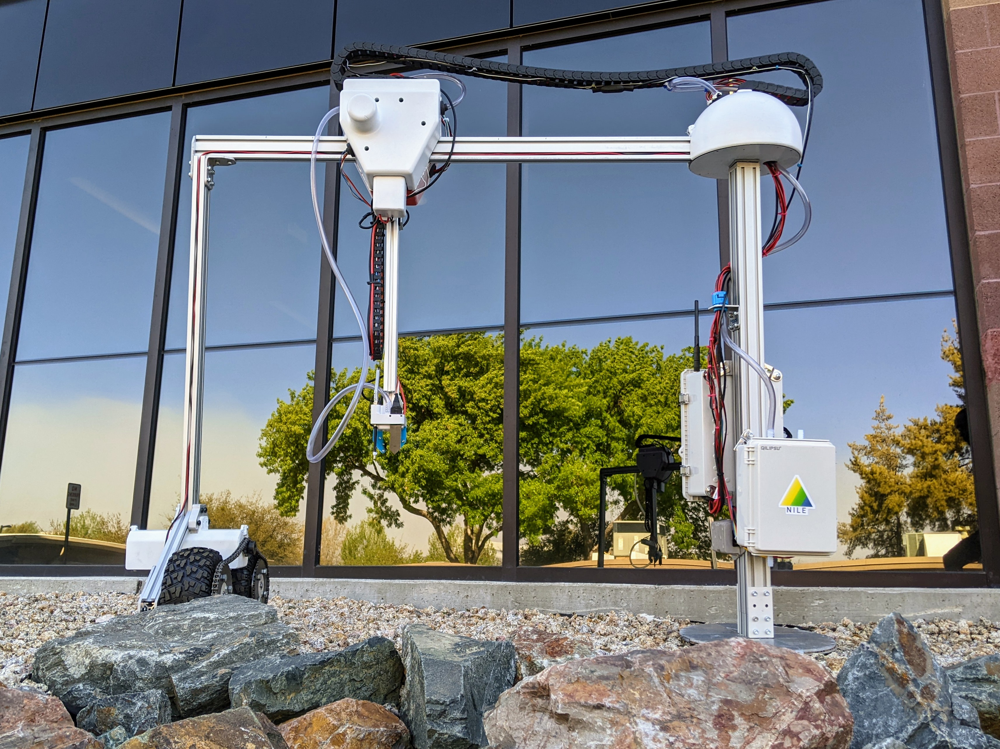
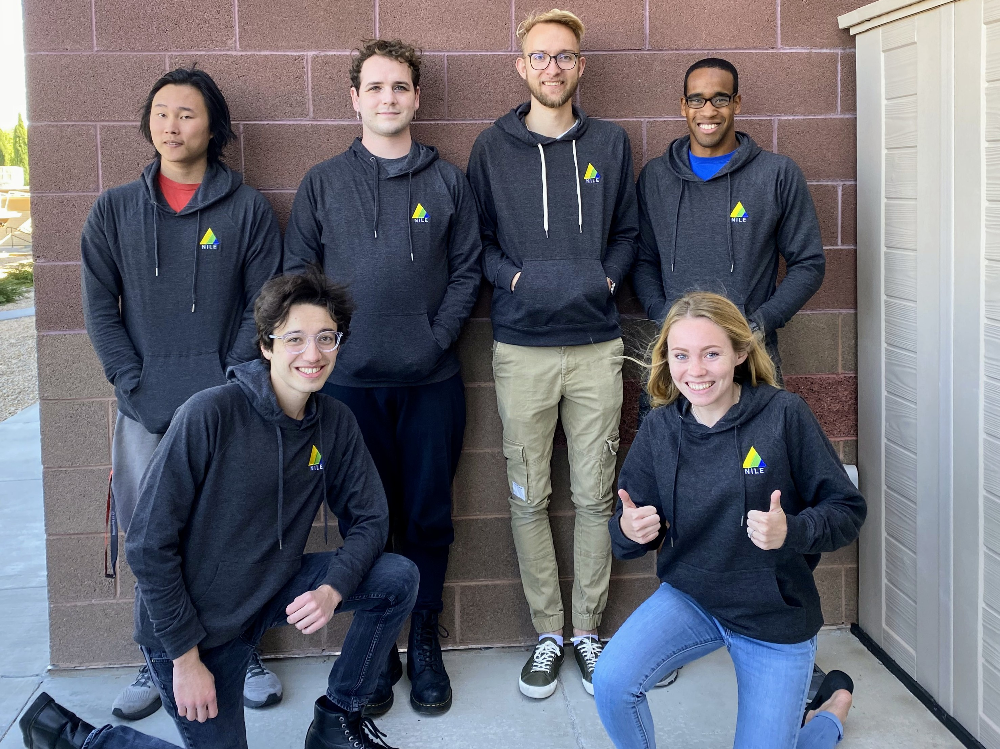

## Welcome to NILE

Conventional agricultural methods overcompensate plant and soil needs through wasteful watering practices and excessive application of pesticides and fertilizers, leading to substantial environmental damage. This damage takes on various forms, including pollution via runoff, soil depletion, and the extinction of local pollinators.

This is where the NILE project comes in. Through our unique, robotic approach to agriculture we aim to precisely care for, and monitor the health of, various crops.

### Weekly Project Updates

2022 - Detailed Design
- 4-22-22: _[The Rise of A.I.](./blog/4-22-22.html)_
- 4-15-22:  _[Put to the Test](./blog/4-15-22.html)_
- 4-8-22:   _[How to Become a Full-Stack Web Developer in a Week or Less](./blog/4-8-22.html)_
- 4-1-22:   _[Introducing Project Hindsight](./blog/4-1-22.html)_
- 3-25-22:  _[It's Alive...ALIVE!!!](./blog/3-25-22.html)_
- 3-4-22:   _[Published Authors!](./blog/3-4-22.html)_
- 2-25-22:  _[Snow and Steady](./blog/2-25-22.html)_
- 2-18-22:  _[Integration, Finally!](./blog/2-18-22.html)_
- 2-11-22:  _[Machine Learning Faster Than the Truck with Our Parts](./blog/2-11-22.html)_
- 2-4-22:   _[We Made Stuff!](./blog/2-4-22.html)_
- 1-28-22:  _[Supply Chain Woes, Sparks, & AI](./blog/1-28-22.html)_
- 1-21-22:  _[Big Week! We purchased our parts!](./blog/1-21-22.html)_
- 1-14-22:  _[Planning the Path Ahead](./blog/1-14-22.html)_

2021 - Preliminary Design
- 12-10-21: _[Preliminary Design Review](./blog/12-10-21.html)_
- 12-3-21:  _[Calm Before the Storm](./blog/12-3-21.html)_
- 11-12-21: _[First Major Design Push](./blog/11-12-21.html)_
- 11-5-21:  _[Preliminary Design Begins](./blog/11-5-21.html)_
- 10-29-21: _[Specifications - Part 3](./blog/10-29-21.html)_
- 10-22-21: _[Specifications - Part 2](./blog/10-22-21.html)_
- 10-15-21: _[Specifications - Part 1](./blog/10-15-21.html)_
- 10-8-21:  _[Conceptual Design - Part 3](./blog/10-8-21.html)_
- 10-1-21:  _[Conceptual Design - Part 2](./blog/10-1-21.html)_
- 9-24-21:  _[Conceptual Design - Part 1](./blog/9-24-21.html)_
- 9-17-21:  _[Cooking Up the Requirements](./blog/9-17-21.html)_
- 9-10-21:  _[Our first blog post!](./blog/9-10-21.html)_

### Technical Documents

- [IEEE SusTech Conference Paper](./assets/Novel_Robotic_Approach_to_Irrigation_and_Agricultural_Land_Use_Efficiency.pdf)
- [Detail Design Document](./assets/NILE_Detail_Design.pdf)
- [Preliminary Design Document](./assets/NILE_Preliminary_Design.pdf)
- [Conceptual Design Document](./assets/NILE_Conceptual_Design.pdf)

### Technical Resources

- [CAD and PCB Files](https://github.com/NILE-ERAU/NILE_Hardware)
- [Main Software Repository](https://github.com/NILE-ERAU/gitrepo)
- [Control Website Repository](https://github.com/NILE-ERAU/NILE_Website)

### The Team

- Lachlan McManus     (ME-Robotics)
- Tia McKenzie        (ME-Robotics)
- Nicodemus Phaklides (EE-Robotics)
- Emmanuel Jefferson  (CE-Robotics)
- Alexander Hoppe     (ME-Robotics)
- Jacob Woodruff      (ME-Robotics)
