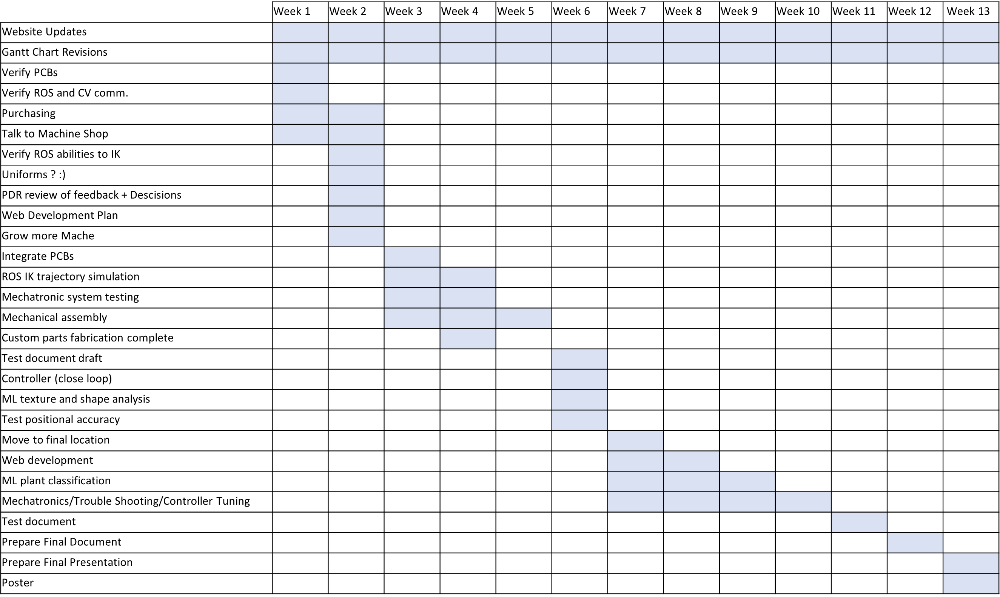

## 1-14-22: Planning the Path Ahead

And we're back! To ease our transition into the fabrication part of the project, we have taken time this week to plan everything out and make sure we are organized. We have created the Gantt Chart below to track our progress.

Additionally, tasks were assigned via SharePoint Planner to everybody to ensure we all stay on schedule. With our current plan, we hope to have fabrication done by the halfway point of the semester in order to properly test the system. So far, we are on track, focusing on purchasing parts and organizing all our orders.

We also spent some time this week verifying our system’s design and applying critique that we received during the PDR. This resulted in some minor changes to the mechanical and electrical designs, mainly involving the cohesion of parts and where they attach. With these final changes and verifying steps, we do feel a lot more confident in our system and ready to purchase all parts by the end of next week.

Having a solid plan and design, we are so excited for this next semester and hope we can deliver something great!

[back](./..)
