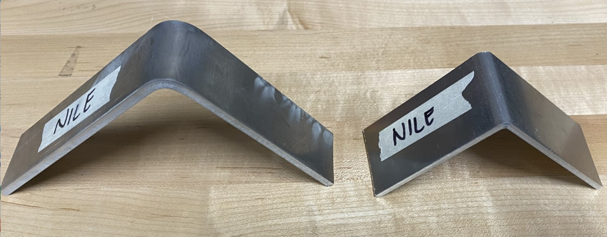

## 1-21-22: Big Week! We purchased our parts!

This week we made exciting progress towards the semester goal of fabricating a prototype of our solution! The purchasing orders have been made and all our parts and stock are on their way! 

In addition to that, we have made several other significant steps forward this week. We planted more mache in eager anticipation for testing to begin. This way we will have mache at various stages of growth and life to analyze and train our machine learning algorithm on. Furthermore, we have verified that ROS is able to run our inverse kinematics equations smoothly. Alongside that, we have begun to research exactly how we will tackle web development later in the semester and have some promising leads. 

Alex and Tia have been in cahoots with the University’s machine shop. We have scavenged scrap material to use for our machined parts and have sent off our DXF files to begin water-jetting on Monday (1/24). Today we did a couple manual bend tests on the two different materials we have chosen to ensure there will not be any cracking on the outer radius of the bends. The coupon on the left shows the bend made in the 3/16” 6061-T6, and the coupon on the right 1/8” 5052. 

We are optimistic that this part of fabrication will be an extremely fun part of the semester. Filled with many lessons-learned, valuable experience, and skills gained!  

This week has been an exciting week for NILE. We cannot wait to let you know what next week will bring in next Friday’s blog post! 

[back](./..)
