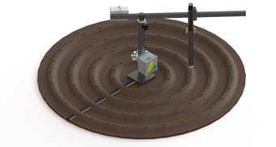
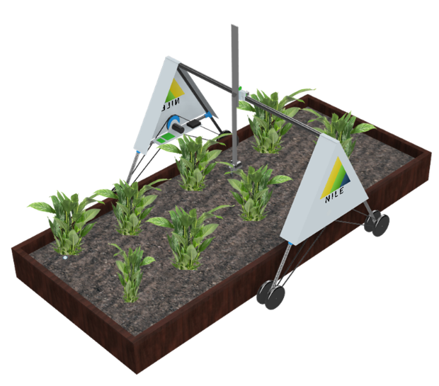
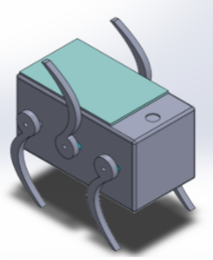
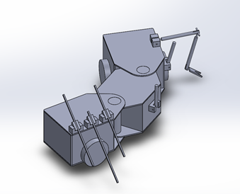
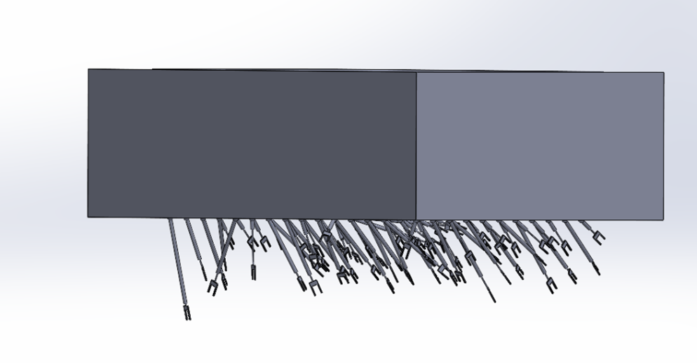
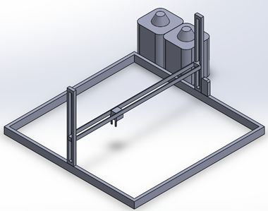

## 10-1-21: Conceptual Design Part 2

At last! Our much-anticipated designs have made their grand entrance! This week was dedicated entirely to presenting individual conceptual designs, and what a treat it was. Bubbling with creativity, each member of the NILE project put imagination into full gear and unveiled their ideas to the class. Below are summaries of each concept, in the words of the originators themselves. 

**Alex Hoppe:** For my conceptual design I took inspiration from the center-pivot system irrigation systems that are ubiquitous throughout the Western United States. My proposal consists of a cylindrical robot with three degrees of freedom: a rotational joint about the center, a horizontal translational joint along the gantry, and a vertical translational joint at the end effector. Furthermore, the robot would support modular end effectors to support the required watering, sensing, and weeding functionality. I believe this novel amalgamation of technology old and new makes the most efficient use of available space while providing a roadmap to industrial scale implementation.

**Nicodemus Phaklides:** My proposal attempts to combine the precision of a Cartesian robot with the range of a mobile one. This is accomplished via an A-Frame design which can tend the plants underneath it via a gantry rail. This system will contain an adjustable end-effector which can fulfill all the sensing and tending needs given by the requirements. Software-wise, there will be a comprehensive False-NDVI computer vision system in order to properly identify plants and their health.

**Tia McKenzie:** For my conceptual design, I attempted to bring a completely new and innovative idea to the table. The design is made up of 4 autonomous mobile robots called “Bugs”. Each bug has a different task to accomplish and is therefore each made up of unique features. There is the WaterBug, FoodBug, VisionBug, and DrillBug which collectively accommodate every system requirement. This design is extremely scalable and can be easily modified to tend to large fields, greenhouses, or even raised flowerbeds. With prong like legs, their damage to the growing zone is minimal as they travel.
Jake Woodruff: My conceptual design proposal is a mobile robot that travels between rows of plants. My design consists of three modules connected by two rotational joints. The two rotational joints allow the robot to have more mobility around corners. The drive system is located within the first and third module and will provide four-wheel drive.  The first module contains the sensors for monitoring plant and soil health. The second module contains a system for watering a plant. The third module contains a system for providing fertilizer and a manipulator for parasite removal. The design is scalable with tank capacity being the most limiting factor.

**Jake Woodruff:** My conceptual design proposal is a mobile robot that travels between rows of plants. My design consists of three modules connected by two rotational joints. The two rotational joints allow the robot to have more mobility around corners. The drive system is located within the first and third module and will provide four-wheel drive.  The first module contains the sensors for monitoring plant and soil health. The second module contains a system for watering a plant. The third module contains a system for providing fertilizer and a manipulator for parasite removal. The design is scalable with tank capacity being the most limiting factor.

**Lachlan McManus:** My proposal designs a system that can simultaneously attend to areas of crops with multitool arms that allow it to gather data whilst moving around the growing zone and sub-soil close application of water and fertilizer. Its mobile design is completely scalable for smaller and larger applications.

**Emmanuel Jefferson:** My proposal aims to simplify mechanical considerations as much as possible, leaving more time and resources for robust weatherproofing and complex software development. As a result, I opted for a 3-axis cartesian chassis that encapsulates the entire growing zone. Much like a 3D-printer, this approach would implement either lead screws or linear actuators to reach any point within the growing zone, and all tools and sensors would be mounted to a single end-effector. This end-effector would sport a stereoscopic camera allowing the system to perform sophisticated image-processing and depth perception even in a clustered plant bed.

[back](./..)
