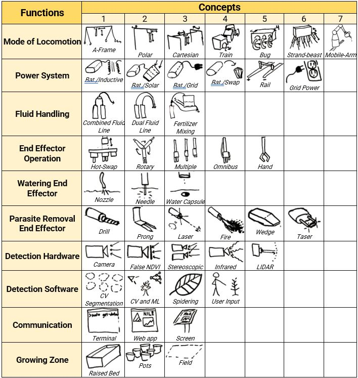

## 10-8-21: Conceptual Design Part 3

Oh yeah! Its all coming together now. This entire week was dedicated to creating a conceptual design for our system as a team, and boy did we have a lot of options to choose from. Last week, each member of the NILE team had presented a unique approach to solving the problem of wasteful agriculture watering practices, and now it was time to mix and match them into a Frankeinstein of optimized features.

To make this process as objective as possible, we started out by creating a morphological chart; a massive table containing all the different design concepts for the requirements our system had to meet. These categories included locomotion, parasite removal, watering mechanism, and so much more. Below is the full table of design concepts, broken down into their respective categories.

This was just the beginning of the great plague of tables. From here we moved onto decision matrices; one for each design category. Within these tables, we came up with a list of criteria that could be used to rank conceptual ideas against each other. Metrics such as cost, ease of implementation, and robustness were just a few items on our rubric list. Here we all donned our judicial robes and began the lengthy, debate-filled process of ranking each design concept against all others within its category; A-frames to strand-beasts, terminals to web apps; everything was given a numerically score and tallied up into a "best fit" score. It wasn't all pretty, and feelings may have been hurt, but when it was all said and done our team had a concept we could agree upon. Read all about it [here](./..)

[back](./..)
