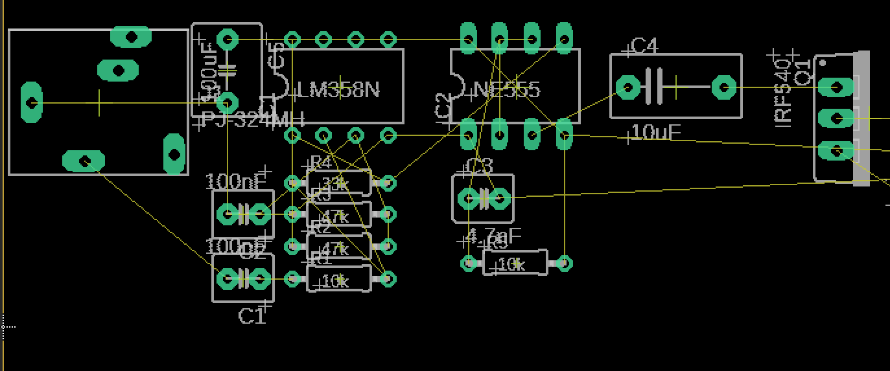
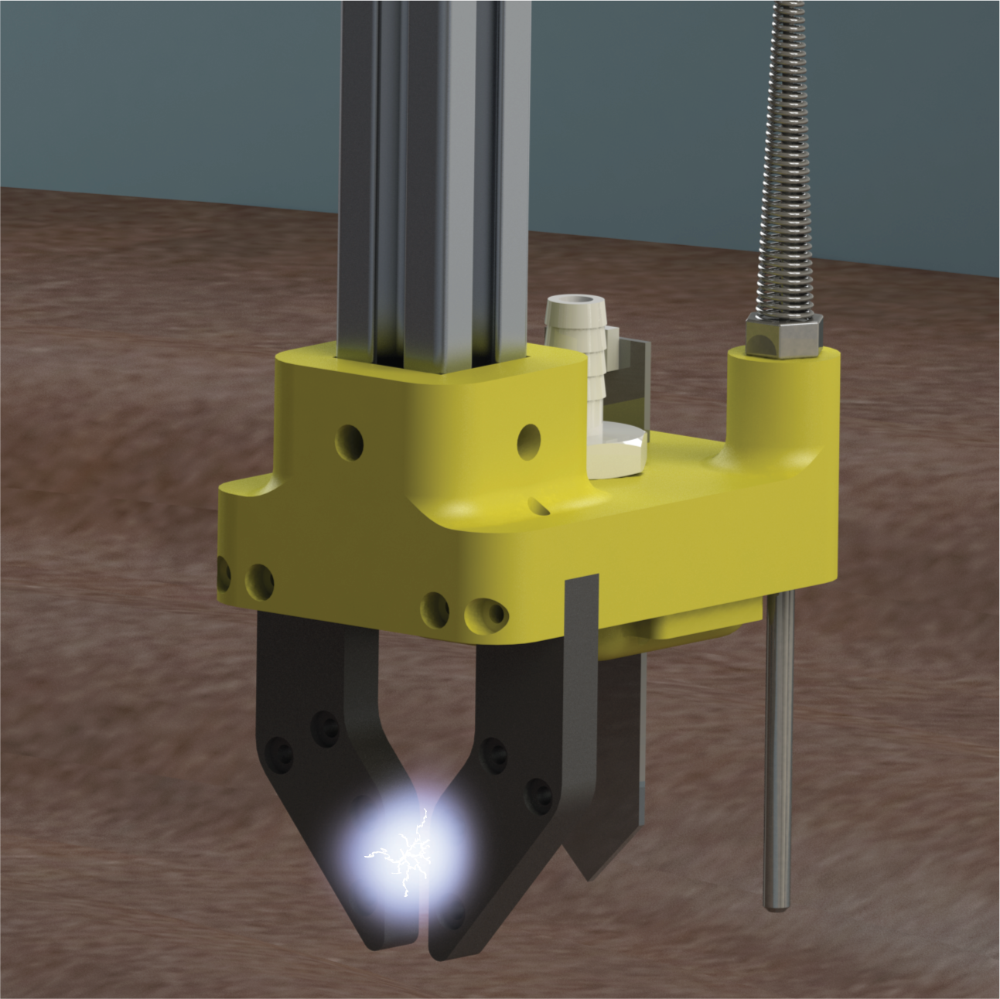
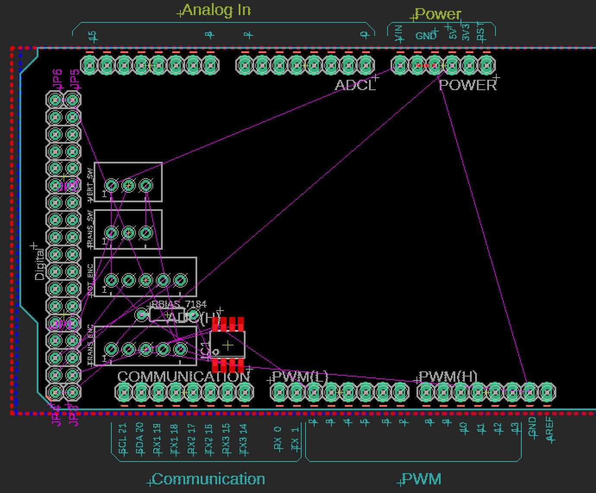
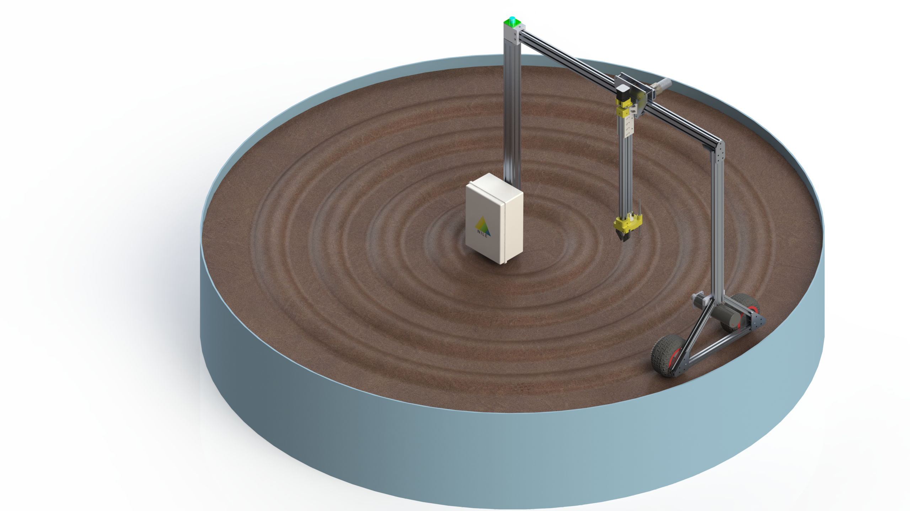

## 11-12-21: First Major Design Push

This week NILE really put its nose to the grindstone and all our members pumped out some impressive work; making significant progress on the software, electrical, and mechanical parts of the project.

On the electrical side of things, our very own High Voltage Elimination Circuit (HVEC) design has been completed. The HVEC will deliver pulses of high voltage straight to the weeds, destroying them from the inside by breaking down xylem walls.

Furthermore, significant process has been made on our hardware board which will manage all the interfacing between our Arduino microcontroller and the various electrical devices (motors, sensors, etc.). There is still much to do but things are proceeding quickly!

On the mechanical side, a major milestone has been completed with the integration of various subsystems into our final design. Eagle eye viewers of our blog may notice that the image below looks awfully like some of our conceptual renders from weeks past. Rest assured that those similarities are only skin deep as this model is nearly ready for manufacturing. As the 80/20 rule goes, 80% of the work is spent on 20% of the output and we are deep in that 20%.

[back](./..)
