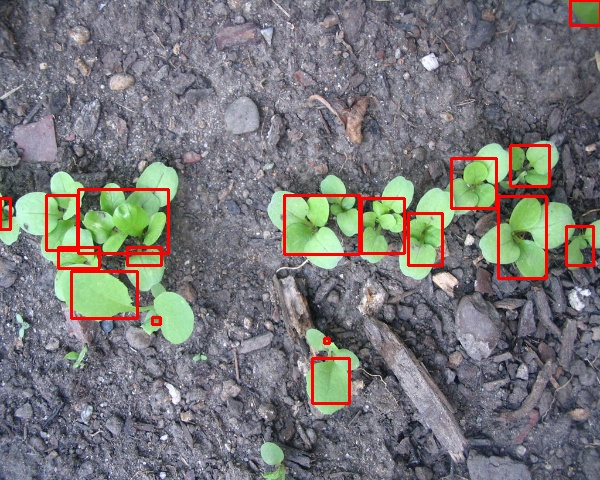

## 12-10-21: Preliminary Design Review

Three months of blood, sweat, and tears all lead to this moment: The Preliminary Design Review. It almost doesn’t feel real, but the NILE preliminary design has officially wrapped, and the team presented our system at Embry Riddle’s Capstone Design Symposium early this morning.

We’ve got CAD:

We’ve got PCBs:

We’ve got code:

And we’ve got a very, very, very long [document](./../assets/NILE_Preliminary_Design.pdf).

The NILE team set about to revolutionize the world of agriculture with our robotic approach and, while we might not be there yet, we are one step closer. The design successfully meets all our system requirements / specifications and was created with budget and scalability in mind. The overcompensation of plant and soil needs through wasteful watering practices and excessive application of pesticides and fertilizers cannot continue and NILE is happy to provide a solution.

We are hopeful as we continue into the critical design phase in the upcoming spring semester. Given all this progress the team should be ready to hit the ground running on January 12th and immediately begin buildout of the prototype stem. We look forward to updating you on our progress then!

[back](./..)
