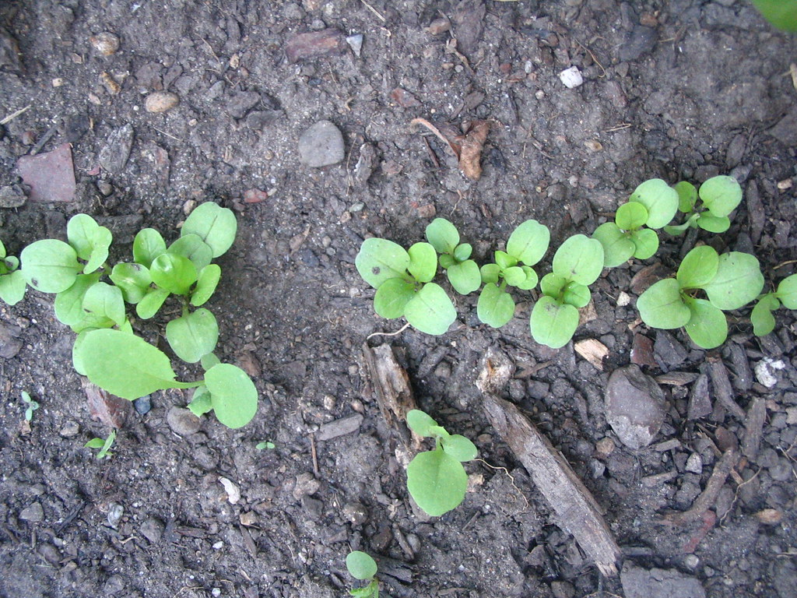
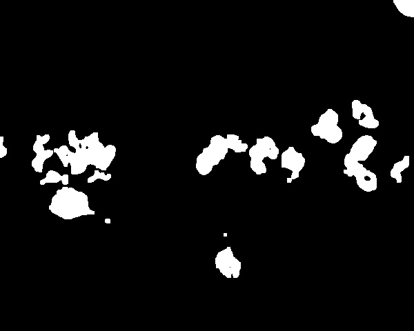
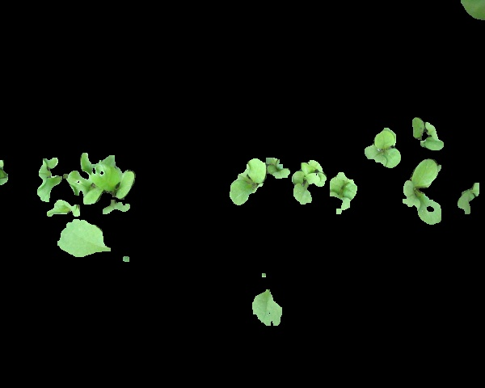
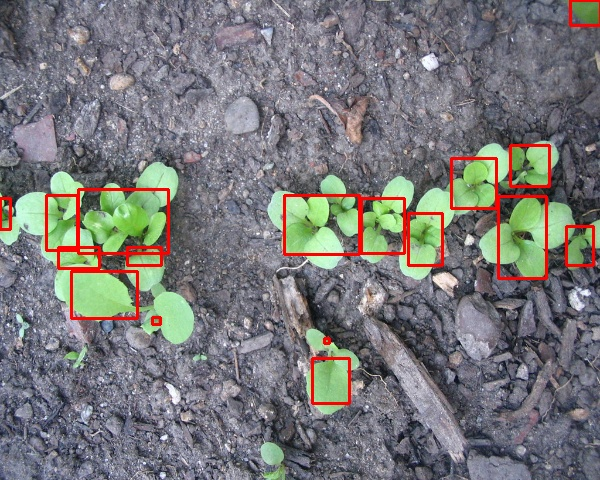

## 12-3-21: Calm Before the Storm (Except Without the Calm)

Preliminary Design Review (PDR) is coming up next Friday and there is so much to do! From CAD drawings and stress analysis, to control algorithms and electrical schematics, there is no shortage of deliverables needed for the hefty PDR presentation in literally 7 days!

Will we get it all done? Absolutely! Because none of us know what we'll do if we don't. As of right now, we're mentally preparing to put in more hours next week than we thought humanely possible; but hey, top-notch capstones don't make themselves. 

Much of the labor exerted this week will turn up in our final design document, presentation, and poster, so stayed tuned for those. However, a bit of good news; machine learning has made its debut! Using images of the real-life mache plants NILE started growing, we were able to use a texture analysis algorithm--called Local Binary Patterns--to train our system to detect greenery in an image, and classify mache plants based on texture alone. While still in its infancy, this approach has already started showing some promise, as shown below.

**Random Mache from Online:**

**Regions of Detected Foilage:**

**Isolated Plant Suspects:**

**Bounded Contours of Mache:**

[back](./..)
