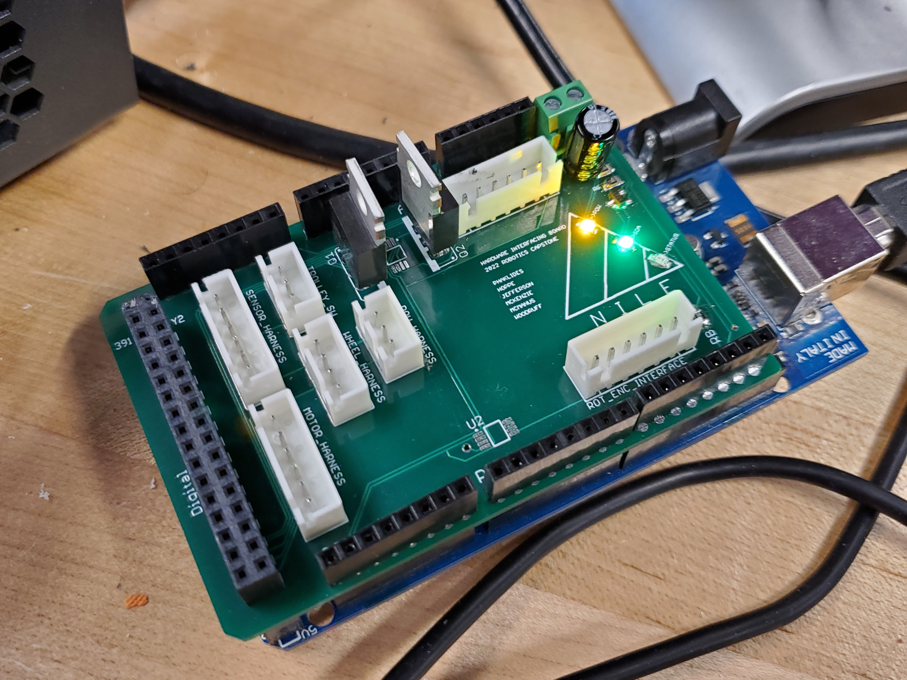
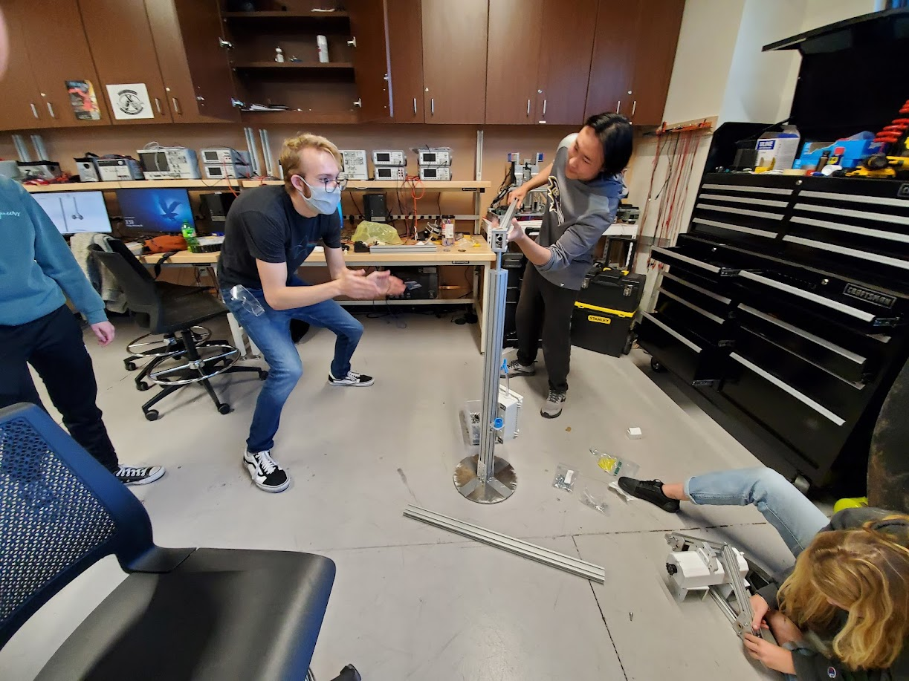
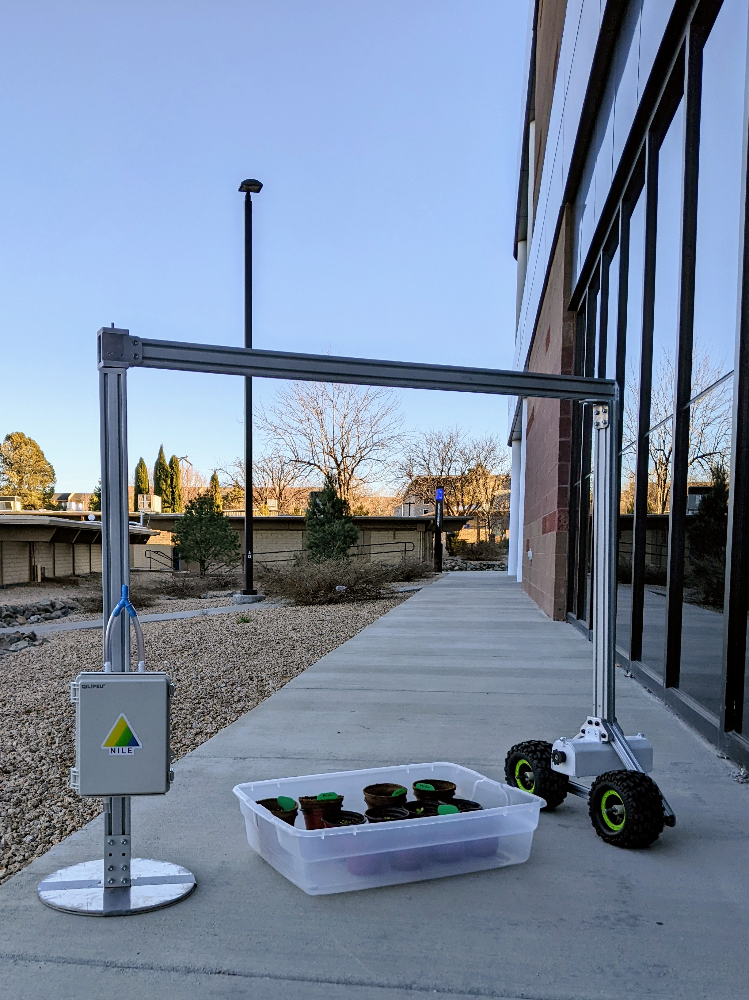

## 2-18-22 - Integration, Finally!

For the past few weeks all integration has been halted mostly due to our PCB’s and 8020 aluminum being held up in shipping. However, this week our pleas have been answered and we can finally build our robot!

The PCB’s have arrived and they look incredible! Work was done on Monday and Tuesday to get everything all soldered and so far, everything on the board works. As for mechatronic integration, it’s now all down to getting all of the harnesses constructed so that they can be interfaced with the board, sensors, and drivers. This takes a while as crimping is very time-intensive. Fortunately, with every failed crimp we only get more powerful and we expect to have all of those done by next week.

On Friday, the critical shipment of our 8020 aluminum extrusions finally arrived. With excitement, our mechanical team has pulled extra hours to get a large majority of the robot assembled. Several of the beams needed to be tapped, and other’s needed to be cut at specific angles. The team learned how to use a horizontal metal saw with a hydraulic lowering system to cut the pieces and we used manual hand die’s to cut the threads into the center of the beams.  The base plate, the central shaft, and the wheel frame were mostly assembled by the end of Friday. 

It’s is truly amazing finally having a robot to view in person. It looks incredible and is a testament to the hundreds of collective hours spent in CAD last semester.

We have Monday off for President’s Day and will be back to assembling on Wednesday. Since we are slightly behind due to the supply-chain issues, we intend to put some extra time in to getting this system mechatronically sound. Exciting times up ahead!

[back](./..)
