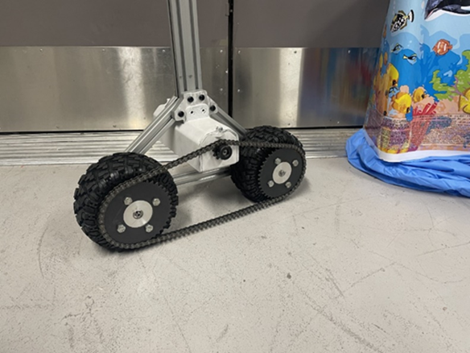
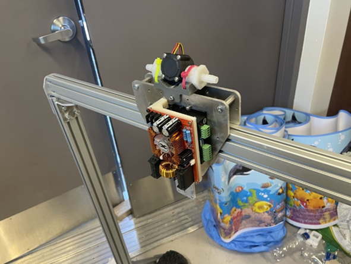
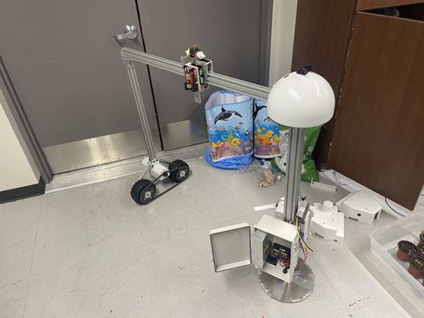

## 2-25-22 - Snow and Steady

This week began with Monday off for President’s Day, but the team was excited to continue our work on Wednesday. Unfortunately, snowfall closed the campus for the entirety of Wednesday. So, instead of working on the robot, we worked on our SusTech paper. The feedback received was successfully implemented, but we are still working on acquiring funding for the presentation fee.

When Friday finally came, we were able to get back to the lab and work on the robot. The mechanical team got right to work finishing up the subsystems that had been started last week. A chain and sprockets were added to the gantry drive platform. Since the chain length was too long, the team learned how to remove links from the chain to properly size it. Our hand calculations turned out to be correct and the chain fit into place on the first try!

While the chain and sprockets were being installed the mechanical team was also working on adding the trolley onto the gantry. The friction wheels needed to be adjusted for the mechanism to slide properly, but corrections were made right away. By the end of the work period the trolley was sliding smoothly across the gantry.

The team’s steady progress continued as we also installed the electrical box. With great physical effort the team was able to attach the electrical box to the base frame central post. Hand threading the screw holes was tough, but the team persevered. With the electrical box installed, trolley smoothly sliding across the gantry, and the chain fitted around the sprockets, the robot is finally coming together! We are planning to put in the necessary hours to finish off the mechanical assembly and start some of the mechatronic testing next week. Excitement is high and we cannot wait to see what we accomplish next week!

[back](./..)
