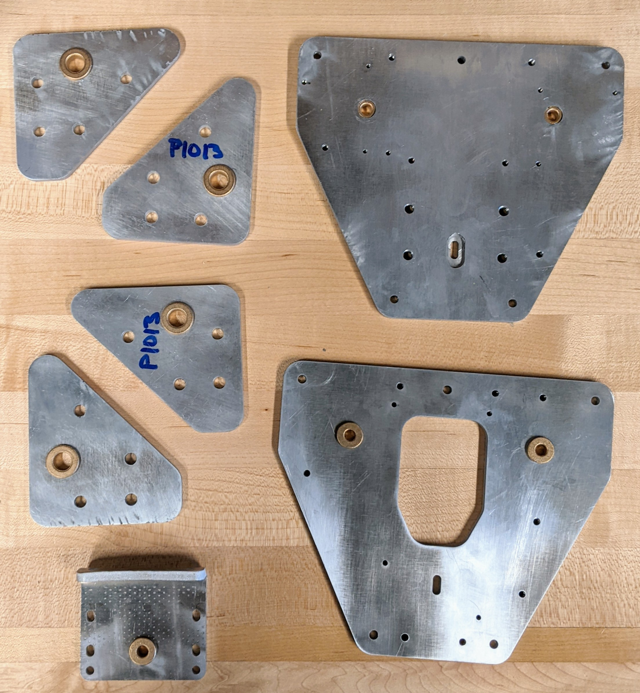
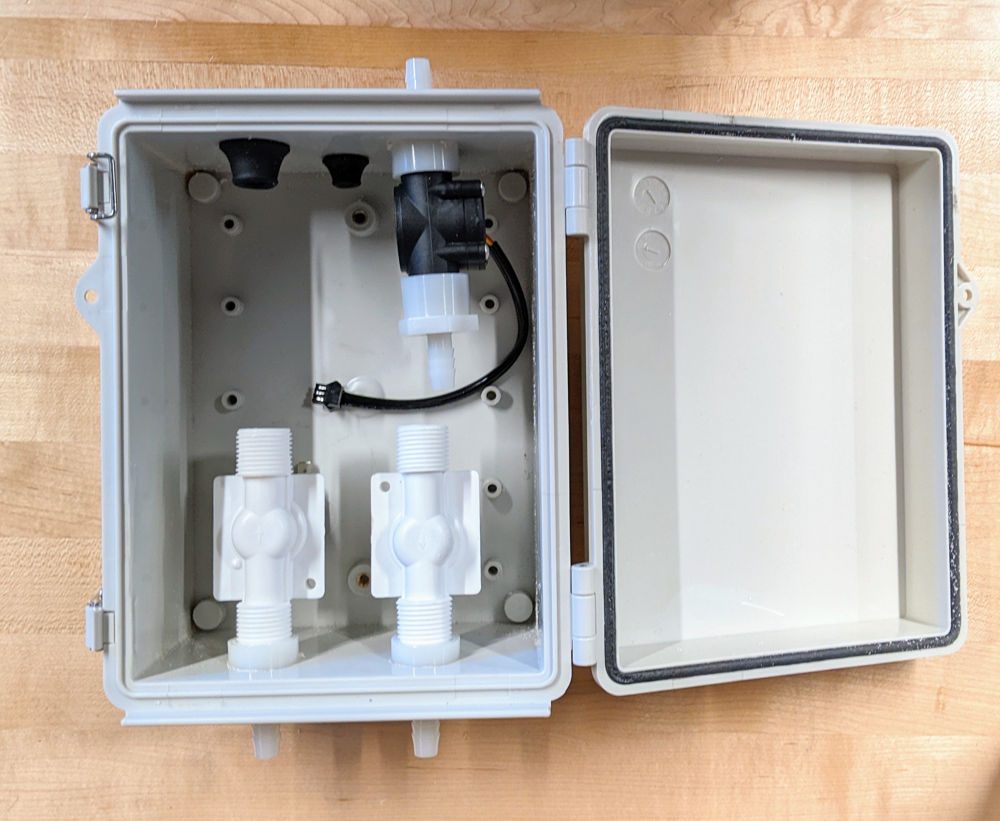

## 2-4-22: We made stuff!

While some on the team are training AI to electrocute humans weeds, others have been hard at work fabricating and assembling the mechanical side of the robot.

Like every project during this pandemic, supply chain shortages have hit hard and forced us to reorganize our schedule. Luckily that has given us time to fabricate some of our custom parts such as the ones below.

Like all our parts these were designed for ease of manufacturing in mind. By utilizing standard sized sheet stock, we were able to quickly cut out the major dimensions and create pilot holes with a waterjet. Then a few tapped holes and one bend later we had 7 parts ready to go. However, not everything can be waterjet and we hope to have our machined and lathed parts finished by the end of next week and ready to assemble.

We have also been working on our fluidic components. Pictured below is our main fluid control box, which controls the flow of water and fertilizer to the nozzle, ready for wiring and plumbing.

We hope our supply chain woes will ease up soon but at this point it’s anyone’s guess. In the meantime, we will soldier on, preparing for quick integration when the final parts arrive.

[back](./..)
