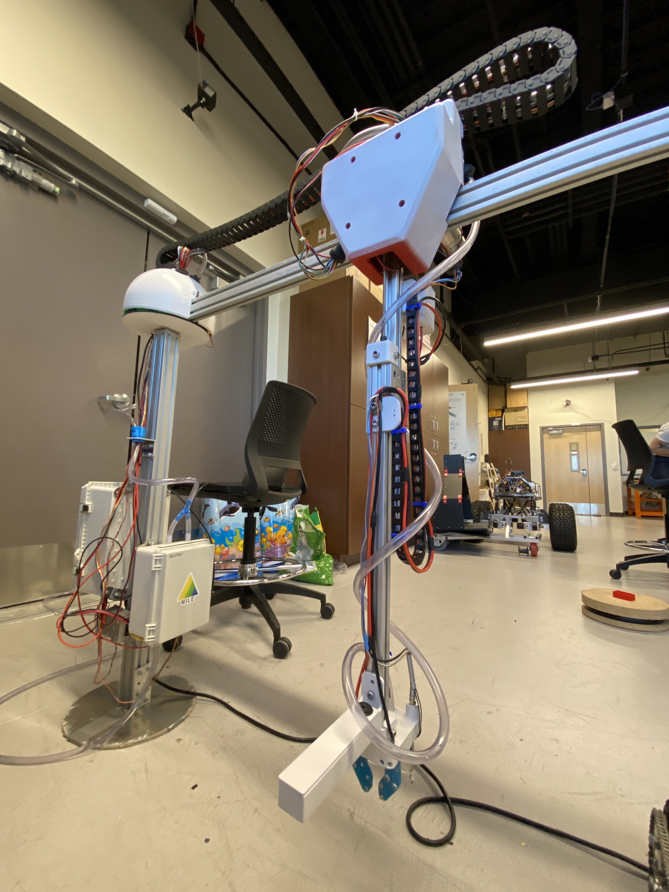
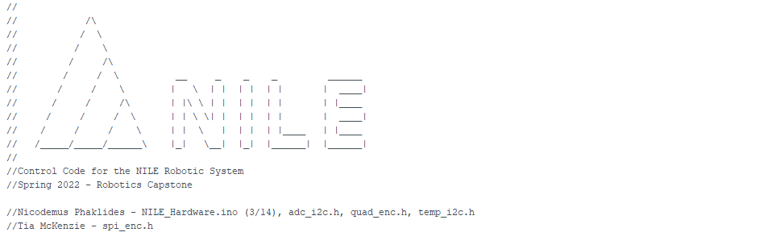

## 3-4-22: It's Alive...ALIVE!!!

Ah yes...it's all coming together now! We had ourselves another fun-filled week of systems integration. In preparation for all the formal performance testing we'll be doing in the coming days, this week spent putting some final touches on the subsystems of our robot. We now have motion for both horizontal and vertical degrees of freedom, as well as tangible proof that our pumps do indeed move water.

As is the case with systems engineering, this endeavor involved a heavy combination of structural assembly, electrical scrutiny, and software algorithm development...all happening simultaneously. The mechanical engineers became programmers, and our code monkeys got down and dirty with the wiring; it really was multidisciplinary collaboration at its finest. Having multpile team members developing code indepedently prompted the need for standardization, which was solved before it even became a problem; naming conventions, function format, and all that other jazz was agreed upon and neatly tucked into our trusty club Github account with a fancy visual becasue we're extra like that.

If only our machine learning specialist would hurry up and solve this plant classification riddle! Artificial intelligence; literally how hard could it be? At this point, we have a compiled dataset of images for training, as well as pictures for testing. We even have a successfully trained machine learning model. The final step is to merge these components--and then do a LOT of fine-tuning. Stay tuned for visual results!

[back](./..)
