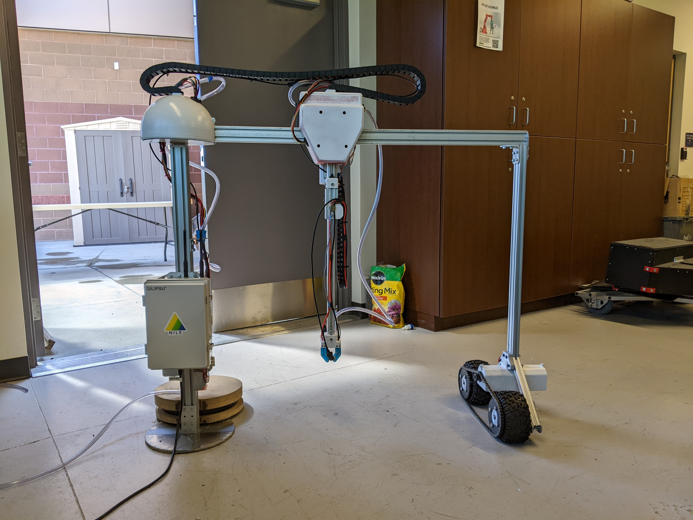

## 4-1-22: Introducing Project Hindsight

Everyone knows the saying “hindsight is 20/20” but what they don’t know is that it is even more relevant when it comes to weed detection. This is because plants look virtually identical regardless of species when in the seedling phase of their life cycle. Because of this, our machine learning algorithms are unable to distinguish between crops and weeds until after they’ve become adult weeds, by which time they’ve stolen valuable water and nutrients. Given this challenge, some members of the team started work on Project Hindsight.

Under Project Hindsight the system waits until the weeds mature enough for identification by the machine learning system. Then, instead of zapping the weed out of existence with the HVEC, Project Hindsight uses a flux capacitor found in our lab to send that information back in time to an earlier iteration of the NILE system. Armed with the information from the future, past NILE can eliminate the weed as soon as it emerges from the ground!

Unfortunately, we did not configure the anti-paradox field correctly and our first test caused the system to fly away at an estimated 88mph before disappearing. See the image below with Dr. Isenberg (capstone advisor) on the left and Alex Hoppe (guinea pig) on the right.

Given current supply change shortages, we were unable to secure another flux capacitor and were forced to abandon Project Hindsight. Luckily, the team was able to completely rebuild the NILE system in record time using lessons learned from the previous iteration. The rebuilt NILE is already fully mechanically and electrically integrated with significant progress made on the low-level software functions.

Given this progress, we will soon be taking NILE outside to put it through its paces. Check back here for more updates!

[back](./..)
