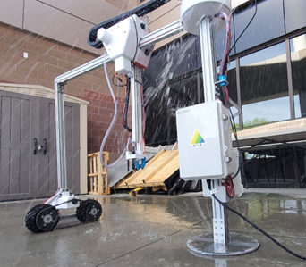

## 4/15/2022: Put to the Test

This has been the ultimate week of testing. With our test document due on Friday (4/15), this week was spent putting our robot under numerous trials. 

The IP55 test kicked off the week and caused quite the drama. Last Wednesday we placed our robot outside where it experienced fast winds, sawdust, dirt, cold temperatures, and very warm temperatures. Living in Northern Arizona, our April climate is notorious for extremely high winds, the risk of being blown away is real. In addition to being in the desert, which causes below freezing temperatures at night while reaching 80 degrees Fahrenheit during the day! After 5 days and 5 nights we sprayed our robot as per our test procedures with pressurized water from a nozzle for a minimum of 5 minutes. Fortunately, our system passed the IP55 test, despite having large concern from almost everyone about spraying what seems to be an open electrical system. However, our mechanical and electrical engineers had successfully waterproofed every component! No damage occurred at all. In hindsight, we probably should have sprayed the robot after we had completed other tests, but alas everything worked out.

 

Other tests that we performed on our robotic system included tests on all the end effector sensors. The soil temperature and moisture sensor were fun tests to run. They both required some perfecting of the code to read data that was accurate and well calibrated. In the end, these edits for both of the sensor tests paid off and proved to be successful components to our robotic system. 

The HVEC was also a fun test to run. Nothing is better than watching our system come to life and seeing all our hard work paying off! We successfully tested and verified the system's ability to create the required discharge voltage for the purpose of plant elimination. Enabling the system and slowly moving the live wires towards one another, an arc was generated at about 3cm. This corresponds to a voltage of around 90kV which meets the voltage spec. We then placed a pot with mâche between the HVEC output prongs. After sending the requisite command to the microcontroller, the HVEC successfully arced between the two prongs and eliminated the plant.
