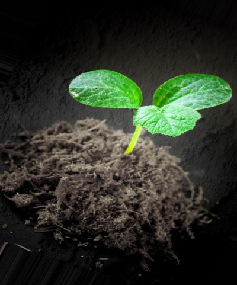

## 4/15/2022: The Rise of A.I.

Machine learning works! Is it perfect? No. Could it use a lot of fine-tuning? Absolutely! But after  4 months of experimentation our system is beginning to apply a trained Convolutional Neural Network to classify images in a real-world environment. Bringing this capability to fruition was a lengthy journey indeed, but here are some of the milestones.

#### Step 1: Assemble a Convolutional Neural Network (CNN)
After extensive research, we decided on an a network architecture called the "MiniVGGNet" which consists of 23 layers of mathematical nodes interconnected in ways too complicated to describe here. Just know that a 23-layerd neural network is considered "deep" by modern standards. Visually, the neural network can be described as a messy web.

#### Step 2: Build an Image Dataset
Easier said than done, because machine learning applications usually require between 1,000 and 5,000 images for each item a developer wants to train the system to recognize. For starters, our system needed to be able to identify dead vegetation, generic plant sprouts, and mature mache. Using a technique called data augmentation we managed to take an original image set of 100 pictures and expand it to 1365 total images for our three training categories.

#### Step 3: Train the CNN
Talk about trial and error! This stage tends to be the most tedious because it literally consists of running training iterations over and over again; giving the CNN the opportunity to sift through the entire image dataset dozens or hundreds of times in search of local and global pixel patterns. The end goal is for the neural network to adjust the mathematical structure of its own layers to align with specific patterns associated with each category being classified. Graphically speaking, training a neural network looks a lot like tracking the stock market.

#### Step 4: Apply the CNN
Here's where rubber finally meets the road! After sufficient exposure to known images, the neural network is ready to tackle images its never seen before. If the nodes and mathematical "weights" are well tuned the CNN will be able to recognize pixel patterns in an arbitrary image and categorize the contents. The human eye paired with the brain accomplishes this subconsciously, but for a machine differentiating a cat from a dog, or dead leaves from fruit is incredibly difficult. Thankfully, our trained algorithm is beginning to show some real promise.

The next order of business will be to combine this with computer vision to pick out healthy and unhealthy plants. With final presentations coming up next Friday we'll see if we can implement that in time!

[back](./..)
