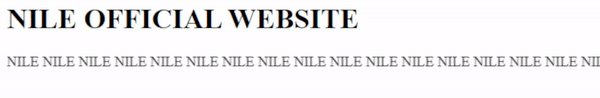
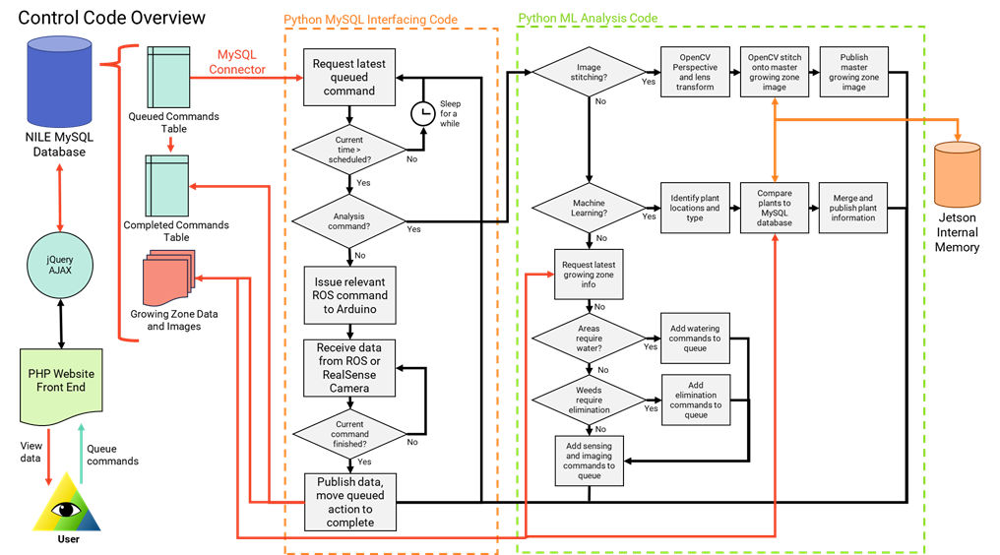
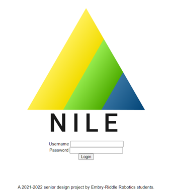
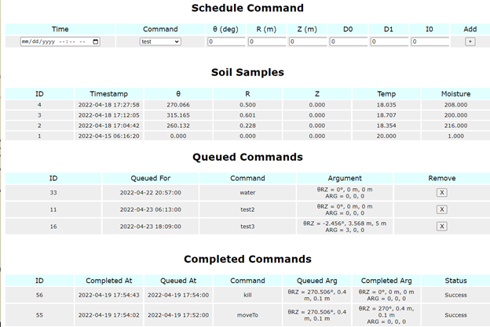
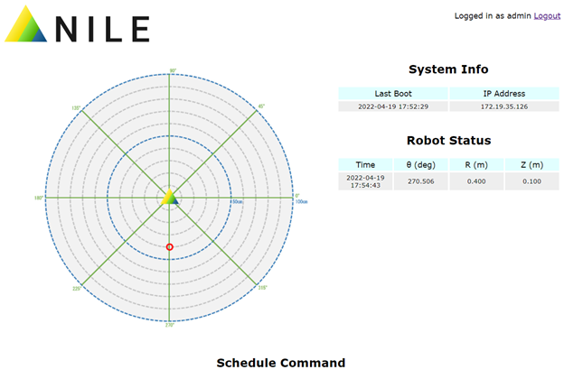
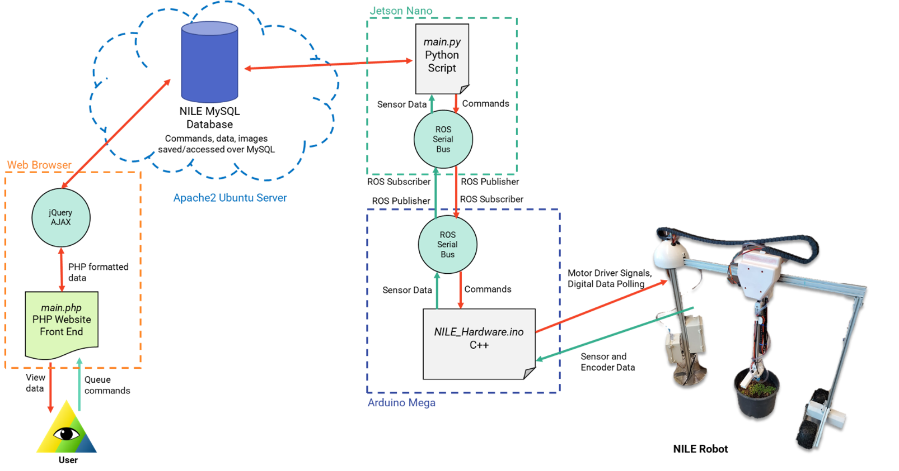

## 4/8/2022: How to Become a Full-Stack Web Developer in a Week or Less

Since the inception of this project, we have promised a web application. This would be for the user to easily monitor their plants and control the robot. Now, no one at the time really knew how to make websites, but we figured we could just tack it on to the end of integration. How hard could it be? We’re going to have the robot assembled by week 7 right? Right?

Well, it is roughly a week until our final test document is due and there is little to no website. Or at least, there is very little. Work had been done by Nicodemus previously to get a barebones HTML page hosted on a small Apache2 server. 
 

 
If you like marquees, this website is perfection. Unfortunately they can’t control robots. For that we are going to need a data access method that allows the robot to upload data to the server and for a user to pass commands to the robot. We used a MySQL database for this as it was very accessible. These databases can not only be queried from our robot using Python MySQL-Connector, but easily visualized on the site via PHP. Using MySQL as the bridge between both systems, there was at least had a plan! We started with identifying what commands will the robot need to respond to. By storing queued commands on the database, the robot could perform large sequences of actions just by going down the list. Additionally, it could add commands to its own queue to autonomously monitor the plants. Other data, including temperature, moisture, and position could also be uploaded to the database. Overall control would look like the following.
 
 

The block for PHP Website Front End does a lot of heavy lifting, so it may be time to elaborate on that. We know we need some sort of login page for security. Can’t just let anybody control the robot. A couple of tutorials (copy-pasting code) later, we had this.

 
 
Alright! Now only authorized users can access our marquee! Let’s visualize some data. There is a JavaScript add-in called jQuery AJAX which can update the HTML on the site dynamically without the user refreshing the page. We used this to display information such as robot position and queued commands in real time (1 second intervals). Additionally, AJAX and PHP allow the user to modify, and schedule queued commands, updating the database accordingly.
 
  

While this functionality on its own was all that was needed for robot control, many quality of life fixes and improvements were still required. The real time position of the robot was added to a table and the joint space position of the robot was drawn onto a HTML5 canvas. This really brought the page to life,
 
   
 
All that was left was getting the robot to interface with the database. There were two loose ends, ROS and MySQL-Connector, that needed to be wrangling. Fortunately, a collaborative effort between Emmanuel and Nicodemus brought the two together, and the system was fully functional. Through this complex pipeline, our robot can be controlled and observed by anybody, anywhere.

   
   
   [back](./..)
