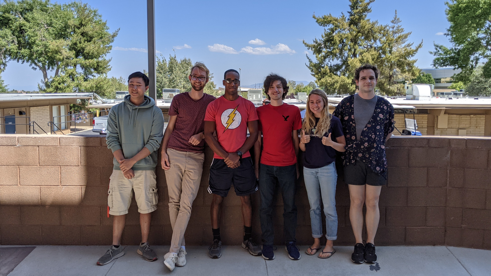

## 9-10-21: Our first blog post!

Welcome to our first NILE blog post! We are a team of robotics students currently studying at Embry-Riddle Aeronautical University with a passion for autonomous systems, sustainability, and solving real-world problems. For our senior engineering capstone, we aim to design, build and test an autonomous robotic solution to the problem statement below: 

Conventional agricultural methods overcompensate plant and soil needs through wasteful watering practices and excessive application of pesticides and fertilizers, leading to substantial environmental damage. This damage takes on various forms, including pollution via runoff, soil depletion, and the extinction of local pollinators. 

This past week has been spent branding our team and writing up our requirements document, which will be available on our website shortly. The system that we will create will monitor soil health and maintain plant health within the growing zone. (Please refer to the requirements document for definitions and more details). 

We are thrilled to be working on such an exciting project and look forward to gaining experience in everything from the design process to prototyping to computer vision/artificial intelligence training!

### The Dream Team

[back](./..)
